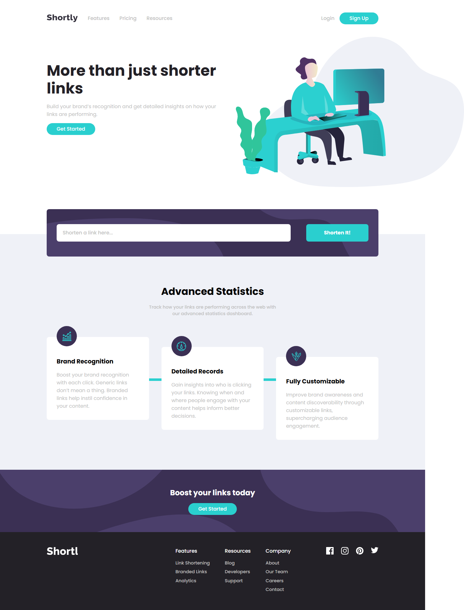

# Frontend Mentor - Shortly URL shortening API Challenge solution

This is a solution to the [Shortly URL shortening API Challenge challenge on Frontend Mentor](https://www.frontendmentor.io/challenges/url-shortening-api-landing-page-2ce3ob-G). Frontend Mentor challenges help you improve your coding skills by building realistic projects. 

## Table of contents

- [Overview](#overview)
  - [The challenge](#the-challenge)
  - [Screenshot](#screenshot)
  - [Links](#links)
- [My process](#my-process)
  - [Built with](#built-with)
  - [What I learned](#what-i-learned)
  - [Continued development](#continued-development)
- [Author](#author)

## Overview

### The challenge

Users should be able to:

- View the optimal layout for the site depending on their device's screen size
- Shorten any valid URL
- See a list of their shortened links, even after refreshing the browser
- Copy the shortened link to their clipboard in a single click
- Receive an error message when the `form` is submitted if:
  - The `input` field is empty

### Screenshot

### Links

- Solution URL: [solution URL at Github](https://github.com/anow47/url-shortening-api)
- Live Site URL: [live site](https://your-live-site-url.com)

## My process
Just getting a working shortening-url API

### Built with

- Semantic HTML5 markup
- CSS custom properties
- Flexbox
- CSS Grid
- SASS
- Vanilla JavaScript
- Web API
- deployed at Netlify

### What I learned

More about creating element with template literals ``. 
Fetch and Request APIs.
More hands on SASS.

### Continued development
// APIs and Proomis 
// SASS

## Author

- Website - [Portfolio](https://www.hamoudadev.com)
- Frontend Mentor - [@anow47](https://www.frontendmentor.io/profile/anow47)

